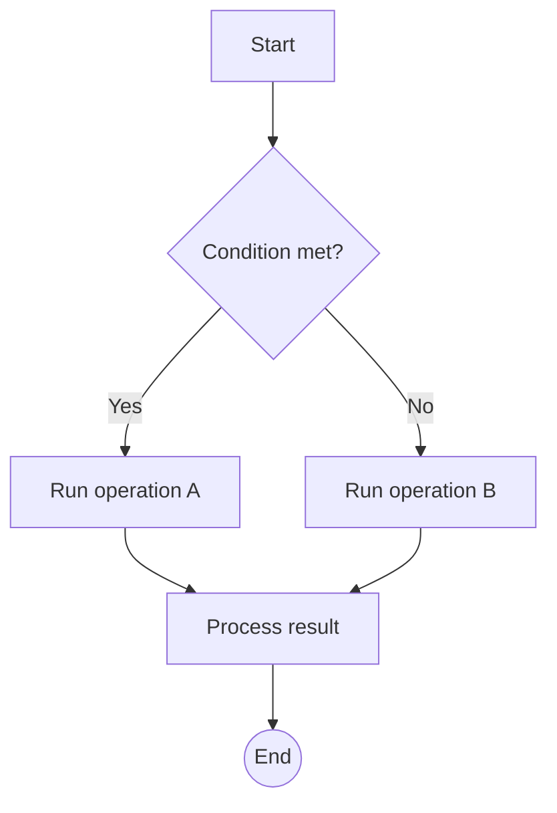
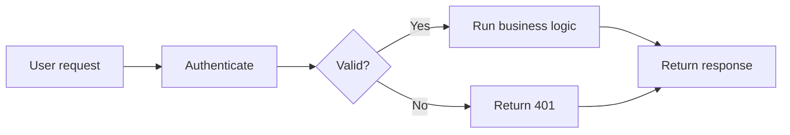
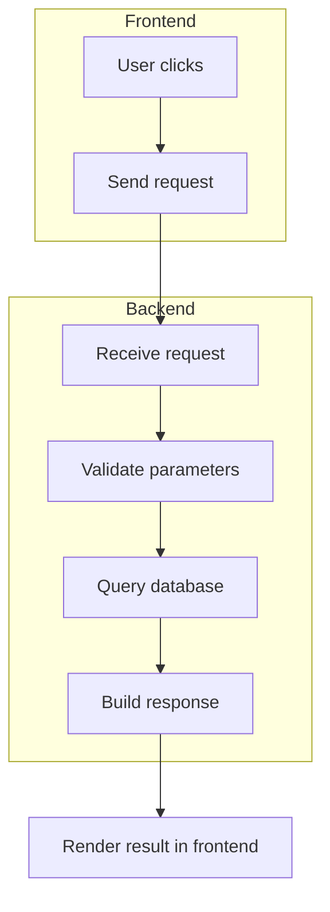
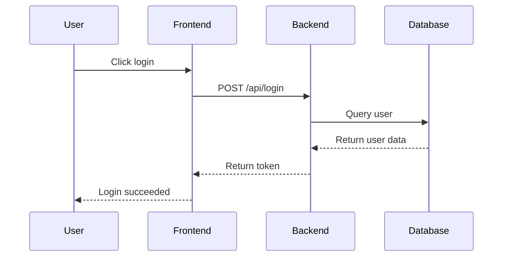
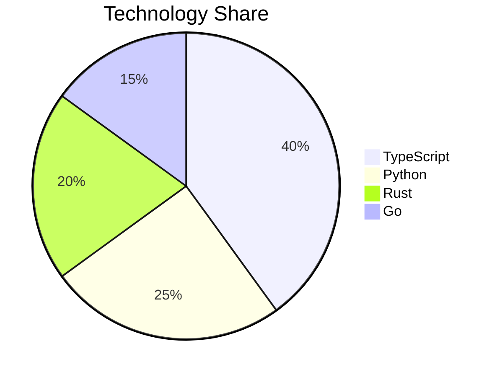
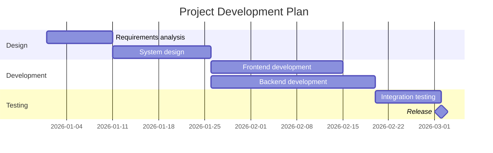
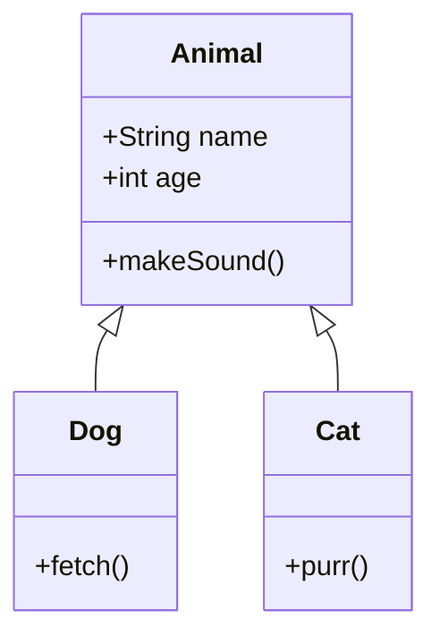

# Markdown Full Feature Test File

This file covers common and extended Markdown syntax. Use it to validate renderer behavior, spacing, escaping, and mixed-content rendering.

---

## 1. Headings

```markdown
# Heading 1
## Heading 2
### Heading 3
#### Heading 4
##### Heading 5
###### Heading 6
```

---

## 2. Text Formatting

**Bold text**

*Italic text*

***Bold and italic text***

~~Strikethrough text~~

==Highlighted text== (extension syntax; renderer support may vary)

`Inline code`

Text with **bold**, *italic*, `code`, and [a link](https://example.com) in the same sentence.

---

## 3. Paragraphs and Line Breaks

This is the first paragraph.

This is the second paragraph, separated by an empty line.

This sentence ends with a hard line break.\
This sentence should start on the next line.

---

## 4. Lists

### Unordered Lists

- Item 1
- Item 2
  - Nested item 2.1
  - Nested item 2.2
- Item 3

+ Plus marker
- Minus marker
* Asterisk marker

### Ordered Lists

1. First item
2. Second item
3. Third item
   1. Nested ordered item
   2. Another nested item
4. Back to the main list

### Task Lists

- [ ] Open task 1
- [x] Completed task 2
- [ ] Open task 3
  - [ ] Nested open task
  - [x] Nested completed task

### Definition Lists (Extension Syntax)

Term 1
:   Definition 1

Term 2
:   Definition 2
:   Continuation of definition 2

---

## 5. Blockquotes

> This is a quoted paragraph.
>
> It can span multiple lines.
>
> > Nested blockquotes are supported.
>
> Blockquotes can include other elements:
>
> - List item
> - **Bold text**
> > Another nested quote

---

## 6. Code

### Inline Code

Use backticks for inline code: `code here`

Inline code can include escaped backticks like ``Use `backticks` inside code``.

### Code Blocks

#### Plain Code Block

```
This is a plain code block.
It has no syntax highlighting.
```

#### Language-Specific Code Blocks

```javascript
// JavaScript example
function greet(name) {
    console.log(`Hello, ${name}!`);
    return true;
}

const arr = [1, 2, 3];
arr.map(x => x * 2);
```

```python
# Python example
def greet(name):
    """Print a greeting."""
    print(f"Hello, {name}!")
    return True

class Person:
    def __init__(self, name):
        self.name = name
```

```css
/* CSS example */
.container {
    display: flex;
    justify-content: center;
    align-items: center;
}

.button {
    background: #007acc;
    color: white;
}
```

```bash
# Bash example
#!/bin/bash
echo "Hello, World!"
for file in *.txt; do
    cat "$file"
done
```

```json
{
  "name": "example",
  "version": "1.0.0",
  "dependencies": {
    "package": "^2.0.0"
  }
}
```

#### Indented Code Block

    This is an indented code block.
    Each line starts with four spaces.

---

## 7. Tables

### Basic Table

| Column 1 | Column 2 | Column 3 |
|----------|----------|----------|
| Data 1.1 | Data 1.2 | Data 1.3 |
| Data 2.1 | Data 2.2 | Data 2.3 |

### Alignment

| Left Aligned | Center Aligned | Right Aligned |
|:-------------|:--------------:|--------------:|
| Left         | Center         | Right         |
| Data         | Data           | Data          |

### Markdown Inside Tables

| Feature | Syntax | Description |
|---------|--------|-------------|
| **Bold** | `**text**` | Bold text inside a table cell |
| *Italic* | `*text*` | Italic text inside a table cell |
| `Code` | `` `code` `` | Inline code inside a table cell |
| [Link](https://example.com) | `[Link](https://example.com)` | Inline link inside a table cell |
| Escaped pipe | `alpha \| beta` | A literal pipe character inside code |

### Empty Cells

| Column 1 | Column 2 | Column 3 |
|----------|----------|----------|
| Data     |          | Data     |
|          | Data     |          |

### Complex Table: Images, LaTeX, HTML, and Mixed Content

| Case | Example | Expected Rendering |
|------|---------|--------------------|
| Image |  | Image should scale inside the table cell |
| Linked image | [](https://github.com) | Image should be clickable |
| Inline LaTeX | $E = mc^2$ | Inline math should render inside a table cell |
| Fraction LaTeX | $\frac{\sqrt{x + 1}}{x - 1}$ | Fraction and square root should render inline |
| Summation LaTeX | $\sum_{i=1}^{n} i = \frac{n(n+1)}{2}$ | Summation should fit without breaking the row |
| HTML controls | <kbd>Ctrl</kbd> + <kbd>K</kbd> | Inline HTML should remain inside the cell |
| Mixed inline content | **Status:** `ready` and [docs](https://commonmark.org/) | Bold, code, and links should combine correctly |
| Escaped characters | \*literal asterisks\* and `a \| b` | Escaped Markdown and escaped pipes should stay readable |

### Table With Dense Technical Content

| Input | Formula | Notes |
|-------|---------|-------|
| `x = [1, 2, 3]` | $\bar{x} = \frac{1}{n}\sum x_i$ | Mean calculation with inline code and math |
| `P(A \| B)` | $P(A \mid B) = \frac{P(B \mid A)P(A)}{P(B)}$ | Escaped pipe in code, conditional probability in LaTeX |
|  | $\int_0^1 x^2 dx = \frac{1}{3}$ | Image and integral in the same row |

---

## 8. Links

### Inline Links

[Text link](https://example.com)

[Link with title](https://example.com "Shown on hover")

### Relative Links

[Link to another document](./other-file.md)

### Reference Links

[Reference link][reference-link]

[reference-link]: https://github.com "GitHub home page"

### Bare URLs

https://example.com

<https://example.com>

### Email Links

<user@example.com>

---

## 9. Images

### Inline Image


### Image With Title


### Reference Image

![Reference image][image-ref]

[image-ref]: https://avatars.githubusercontent.com/u/20858116?s=40&v=4

### Image Nested in a Link

[](https://github.com)

---

## 10. Horizontal Rules

***

---

___

* * *

---

## 11. Escaping

\*Not bold\*

\[Not a link\]

\`Not code\`

\# Not a heading

Use a backslash before a pipe in table-sensitive text: `a \| b`.

---

## 12. HTML in Markdown

### Inline HTML

This sentence contains <strong>HTML bold</strong> and <em>HTML italic</em>.

### HTML Block

<div style="color: red;">
    This is red text inside an HTML div.
</div>

<details>
<summary>Expand collapsible content</summary>

This content is hidden until the details block is opened.

</details>

---

## 13. Math Formulas

### Inline Math

Mass-energy equivalence: $E = mc^2$

Pythagorean theorem: $a^2 + b^2 = c^2$

Bayes theorem: $P(A \mid B) = \frac{P(B \mid A)P(A)}{P(B)}$

### Block Math

Quadratic formula:

$$
x = \frac{-b \pm \sqrt{b^2 - 4ac}}{2a}
$$

Summation formula:

$$
\sum_{i=1}^{n} i = \frac{n(n+1)}{2}
$$

Integral:

$$
\int_{0}^{\infty} x^2 e^{-x} dx = 2
$$

Matrix:

$$
\begin{pmatrix}
a & b \\
c & d
\end{pmatrix}
$$

Fraction and square root:

$$
\frac{\sqrt{x+1}}{x-1}
$$

Piecewise function:

$$
f(x)=
\begin{cases}
x^2, & x \ge 0 \\
-x, & x < 0
\end{cases}
$$

---

## 14. Footnotes (Extension Syntax)

This sentence has a footnote reference.[^1]

This sentence has another footnote.[^note]

[^1]: This is the first footnote.
[^note]: This is a named footnote. It can include more descriptive text.

---

## 15. Abbreviations (Extension Syntax)

*[HTML]: Hyper Text Markup Language
*[CSS]: Cascading Style Sheets

HTML and CSS are core Web technologies.

---

## 16. Mark (Extension Syntax)

==This text is highlighted with mark syntax.==

---

## 17. Superscript and Subscript (Extension Syntax)

Subscript: H~2~O

Superscript: X^2^

---

## 18. Emoji

😀 😃 😄 😁 😆 😅 🤣 😂

---

## 19. Special Characters

&copy; copyright symbol

&reg; registered trademark

&trade; trademark

&amp; ampersand

&lt; less than

&gt; greater than

&hearts; heart

&diams; diamond

---

## 20. Mermaid Flowcharts

### Basic Flowchart



### Left-to-Right Flowchart



### Flowchart With Subgraphs



---

## 21. Mermaid Sequence Diagram



---

## 22. Other Mermaid Diagrams

### Pie Chart



### Gantt Chart



### Class Diagram



---

## 23. Mixed Examples

### List Inside a Code Block

```markdown
1. Item 1
2. Item 2
   - Child item
```

### Code Inside a Blockquote

> Use `console.log()` to print information.

### Link List

- [CommonMark specification](https://commonmark.org/)
- [GitHub Flavored Markdown](https://github.github.com/gfm/)

### Image Inside a Table

| Icon | Name | Description |
|------|------|-------------|
|  | Logo | Site logo |
| [](https://github.com) | Linked logo | Clickable image in a table |

### LaTeX Inside a Table

| Name | Inline Formula | Notes |
|------|----------------|-------|
| Energy | $E = mc^2$ | Simple inline math |
| Normal distribution | $\frac{1}{\sigma\sqrt{2\pi}}e^{-\frac{1}{2}\left(\frac{x-\mu}{\sigma}\right)^2}$ | Long formula in a table cell |
| Matrix determinant | $\det\begin{pmatrix}a & b \\ c & d\end{pmatrix}=ad-bc$ | Matrix-style LaTeX in a compact cell |

### Nested Markdown Stress Case

> #### Quoted heading
>
> | Step | Content |
> |------|---------|
> | 1 | **Bold text** with `inline code` |
> | 2 |  and $a^2 + b^2 = c^2$ |
>
> - [x] Completed item inside a quote
> - [ ] Open item inside a quote

---

## Test Complete

This file covers common Markdown syntax, extension syntax, and mixed-content edge cases for renderer compatibility testing.

---

*Last updated: 2026-05-15*
