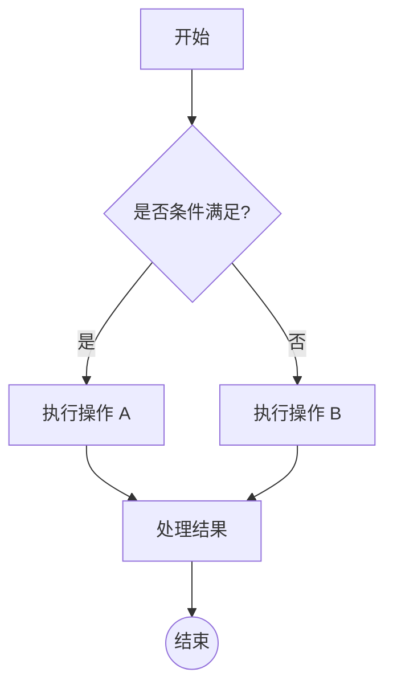
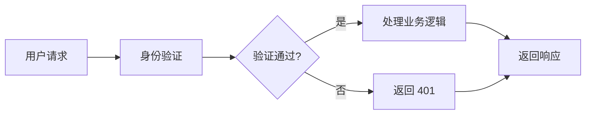
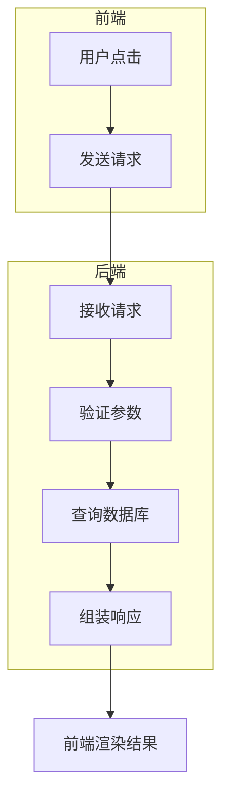
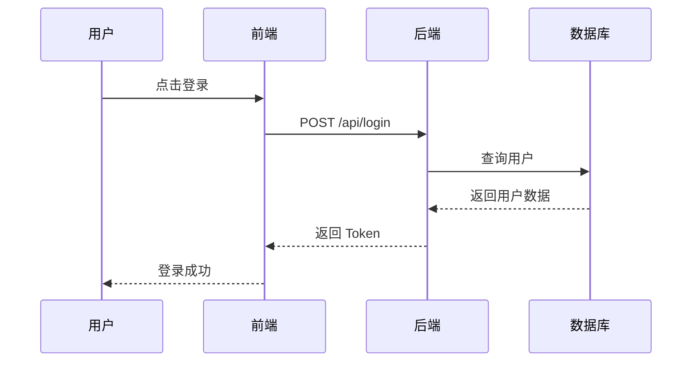
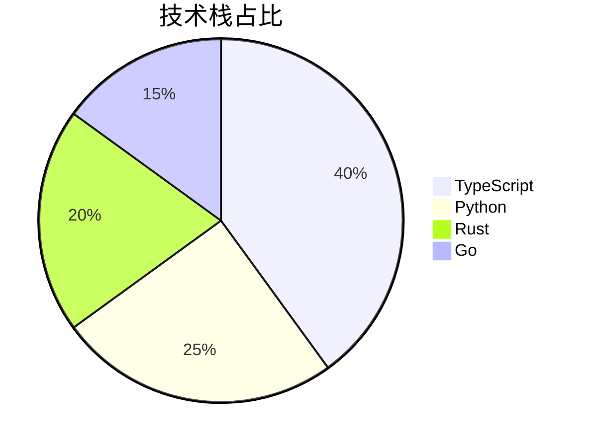
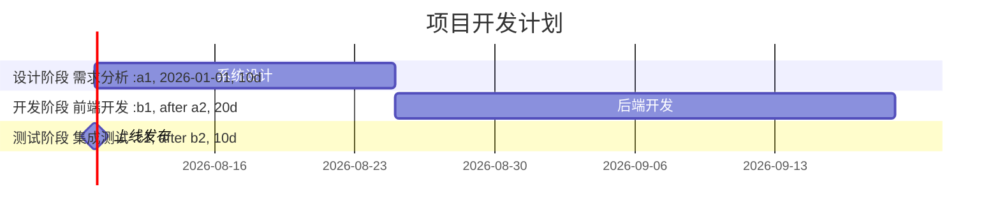
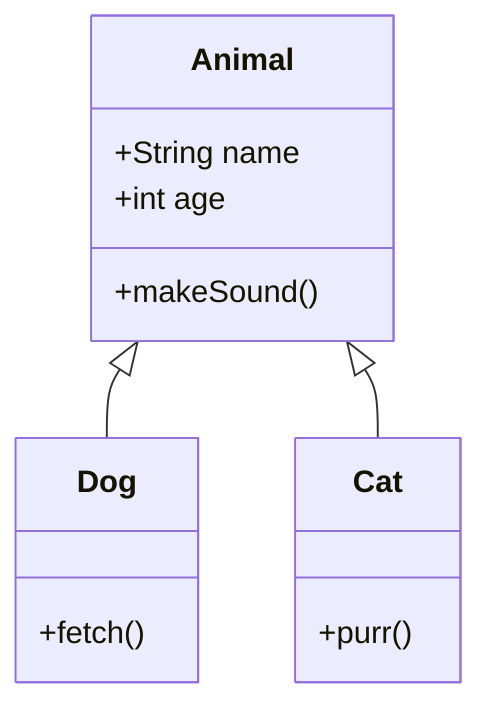

# Markdown 全功能测试文件

这是一个包含所有常见 Markdown 语法的测试文件，用于验证渲染效果。

---

## 1. 标题 (Headings)

```markdown
# 一级标题
## 二级标题
### 三级标题
#### 四级标题
##### 五级标题
###### 六级标题
```

---

## 2. 文本格式 (Text Formatting)

**粗体文本** (Bold)

*斜体文本* (Italic)

***粗斜体文本*** (Bold + Italic)

~~删除线~~ (Strikethrough)

==高亮文本== (Highlight - 部分支持)

`行内代码` (Inline Code)

---

## 3. 段落与换行

这是第一段。

这是第二段（空行分隔）。

这是同一行内的硬换行（两个空格+回车）。

---

## 4. 列表 (Lists)

### 无序列表 (Unordered Lists)

- 项目 1
- 项目 2
  - 嵌套项目 2.1
  - 嵌套项目 2.2
- 项目 3

+ 使用加号
- 使用减号
* 使用星号

### 有序列表 (Ordered Lists)

1. 第一项
2. 第二项
3. 第三项
   1. 嵌套有序列表
   2. 继续嵌套
4. 回到主列表

### 任务列表 (Task Lists)

- [ ] 未完成任务 1
- [x] 已完成任务 2
- [ ] 未完成任务 3
  - [ ] 嵌套未完成
  - [x] 嵌套已完成

### 定义列表 (Definition Lists - 扩展语法)

术语 1
:   定义 1

术语 2
:   定义 2
:   定义 2 的延续

---

## 5. 引用 (Blockquotes)

> 这是一段引用文本。
>
> 可以有多行。
>
> > 支持嵌套引用。
>
> 引用中可以包含其他元素：
>
> - 列表项
> - **粗体**
> > 嵌套引用

---

## 6. 代码 (Code)

### 行内代码 (Inline Code)

使用反引号：`code here`

### 代码块 (Code Blocks)

#### 普通代码块

```
这是普通代码块
没有语法高亮
```

#### 语言指定 (Syntax Highlighting)

```javascript
// JavaScript 示例
function greet(name) {
    console.log(`Hello, ${name}!`);
    return true;
}

const arr = [1, 2, 3];
arr.map(x => x * 2);
```

```python
# Python 示例
def greet(name):
    """打印问候语"""
    print(f"Hello, {name}!")
    return True

class Person:
    def __init__(self, name):
        self.name = name
```

```css
/* CSS 示例 */
.container {
    display: flex;
    justify-content: center;
    align-items: center;
}

.button {
    background: #007acc;
    color: white;
}
```

```bash
# Bash 示例
#!/bin/bash
echo "Hello, World!"
for file in *.txt; do
    cat "$file"
done
```

```json
{
  "name": "example",
  "version": "1.0.0",
  "dependencies": {
    "package": "^2.0.0"
  }
}
```

#### 缩进代码块

    这是缩进代码块
    每行前面有4个空格

---

## 7. 表格 (Tables)

### 基本表格

| 列 1 | 列 2 | 列 3 |
|------|------|------|
| 数据 1.1 | 数据 1.2 | 数据 1.3 |
| 数据 2.1 | 数据 2.2 | 数据 2.3 |

### 对齐方式

| 左对齐 | 居中对齐 | 右对齐 |
|:-------|:-------:|-------:|
| Left   | Center  | Right  |
| 数据   | 数据    | 数据   |

### 复杂表格

| 功能 | 语法 | 说明 |
|------|------|------|
| **粗体** | `**text**` | 粗体文本 |
| *斜体* | `*text*` | 斜体文本 |
| `代码` | `` `code` `` | 行内代码 |

### 空单元格

| 列 1 | 列 2 | 列 3 |
|------|------|------|
| 数据 |      | 数据 |
|      | 数据 |      |

---

## 8. 链接 (Links)

### 行内链接

[文本链接](https://example.com)

[带标题的链接](https://example.com "鼠标悬停显示")

### 相对路径链接

[链接到文档](./other-file.md)

### 引用式链接

[引用链接][reference-link]

[reference-link]: https://github.com "GitHub 主页"

### URL 直接链接

https://example.com

<https://example.com>

### 邮件链接

<user@example.com>

---

## 9. 图片 (Images)

### 行内图片


### 带标题的图片


### 引用式图片

![引用图片][image-ref]

[image-ref]: https://avatars.githubusercontent.com/u/20858116?s=40&v=4

---

## 10. 分隔线 (Horizontal Rules)

***

---

___

* * *

---

## 11. 转义字符 (Escaping)

\*不是粗体\*

\[不是链接\]

\`不是代码\`

---

## 12. HTML 支持 (HTML in Markdown)

### 行内 HTML

这是 <strong>HTML 粗体</strong> 和 <em>斜体</em>。

### HTML 块

<div style="color: red;">
    这是红色文本（HTML div）
</div>

<details>
<summary>点击展开折叠内容</summary>

这是隐藏的内容！

</details>

---

## 13. 数学公式 (Math Formulas)

### 行内公式

质能方程：$E = mc^2$

勾股定理：$a^2 + b^2 = c^2$

### 块级公式

二次公式：

$$
x = \frac{-b \pm \sqrt{b^2 - 4ac}}{2a}
$$

求和公式：

$$
\sum_{i=1}^{n} i = \frac{n(n+1)}{2}
$$

积分：

$$
\int_{0}^{\infty} x^2 e^{-x} dx = 2
$$

矩阵：

$$
\begin{pmatrix}
a & b \\
c & d
\end{pmatrix}
$$

分数和根号：

$$
\frac{\sqrt{x+1}}{x-1}
$$

---

## 14. 脚注 (Footnotes - 扩展语法)

这是一个脚注引用[^1]。

这是另一个脚注[^note]。

[^1]: 这是第一个脚注的内容。
[^note]: 这是命名脚注的内容，可以包含多行。

---

## 15. 缩写 (Abbreviations - 扩展语法)

*[HTML]: Hyper Text Markup Language
*[CSS]: Cascading Style Sheets

HTML 和 CSS 是 Web 开发的基础。

---

## 16. 标记 (Mark - 扩展语法)

==这段文本被高亮标记==

---

## 17. 上标和下标 (Superscript & Subscript - 扩展语法)

下标：H~2~O

上标：X^2^

---

## 18. Emoji 表情

😀 😃 😄 😁 😆 😅 🤣 😂


---

## 19. 特殊字符

&copy; 版权符号
&reg; 注册商标
&trade; 商标
&amp; 和号
&lt; 小于
&gt; 大于
&hearts; ♥
&diams; ♦

---

## 20. Mermaid 流程图 (Mermaid Diagrams)

### 基本流程图



### 横向流程图



### 带子流程的流程图



---

## 21. Mermaid 时序图 (Sequence Diagrams)



---

## 22. Mermaid 其他图表

### 饼图



### 甘特图



### 类图



---

## 23. 混合示例

### 代码块中的列表

```markdown
1. 项目 1
2. 项目 2
   - 子项目
```

### 引用中的代码

> 使用 `console.log()` 来输出信息。

### 列表中的链接

- [Markdown 官方规范](https://commonmark.org/)
- [GitHub Flavored Markdown](https://github.github.com/gfm/)

### 表格中的图片

| 图标 | 名称 | 说明 |
|------|------|------|
|  | Logo | 网站标志 |

---

## 测试完成

此文件涵盖了 Markdown 的常见语法和扩展语法，可用于测试渲染器的兼容性和功能完整性。

---

*最后更新：2026-02-26*
